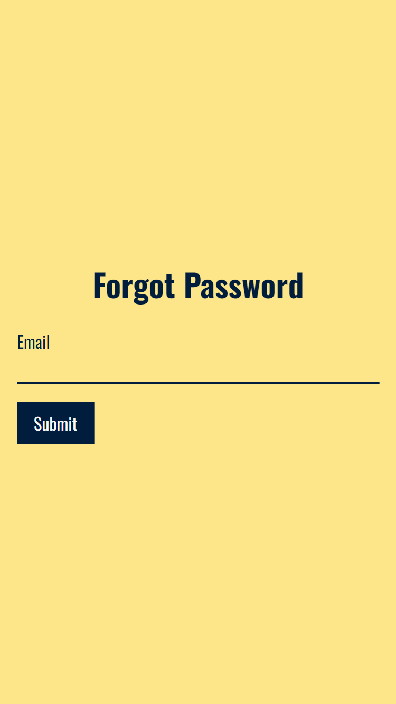
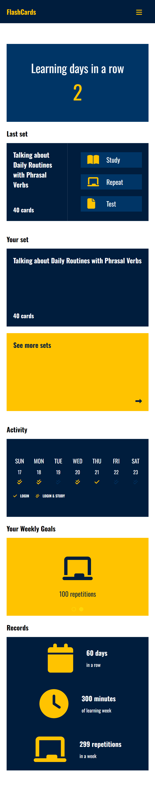
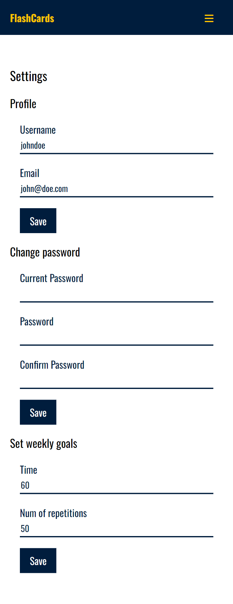
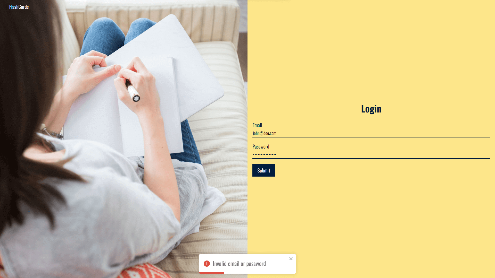
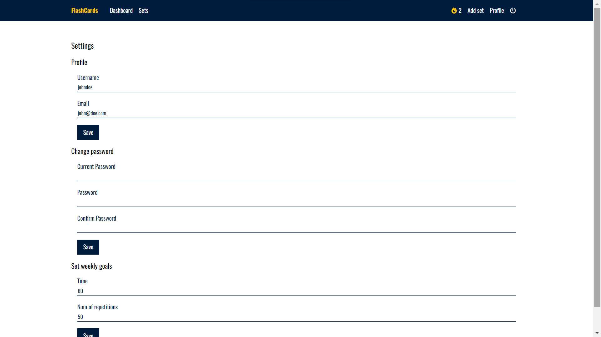
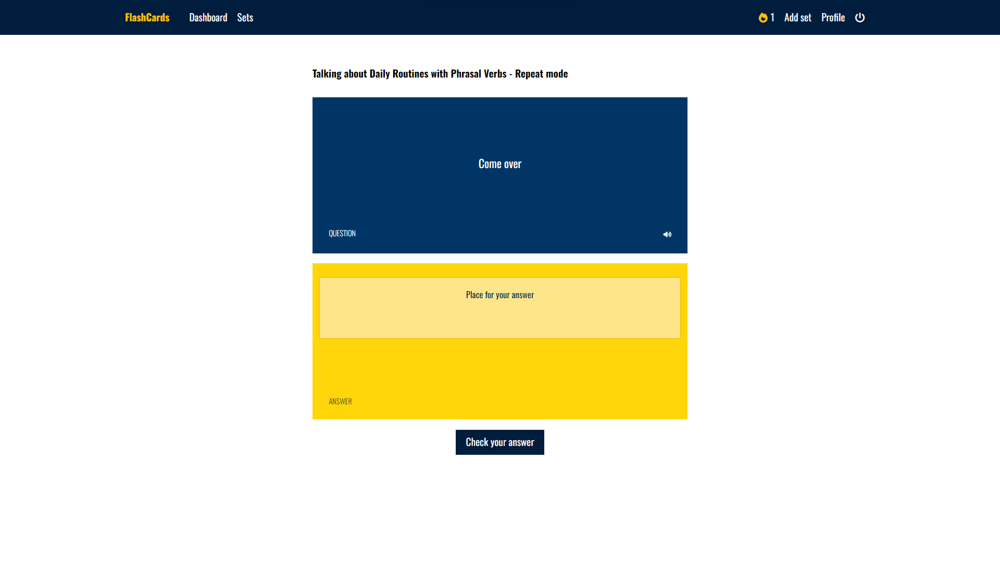
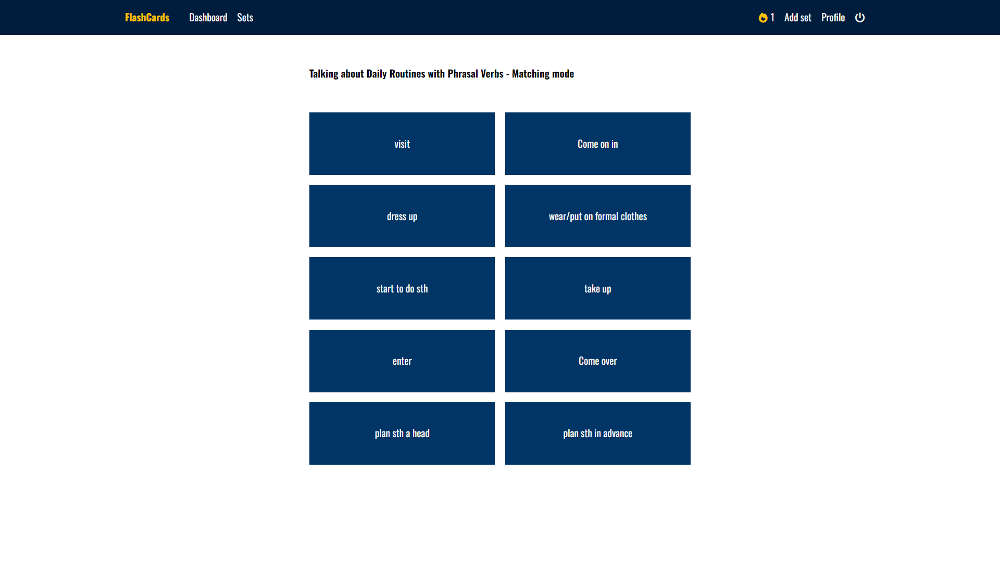
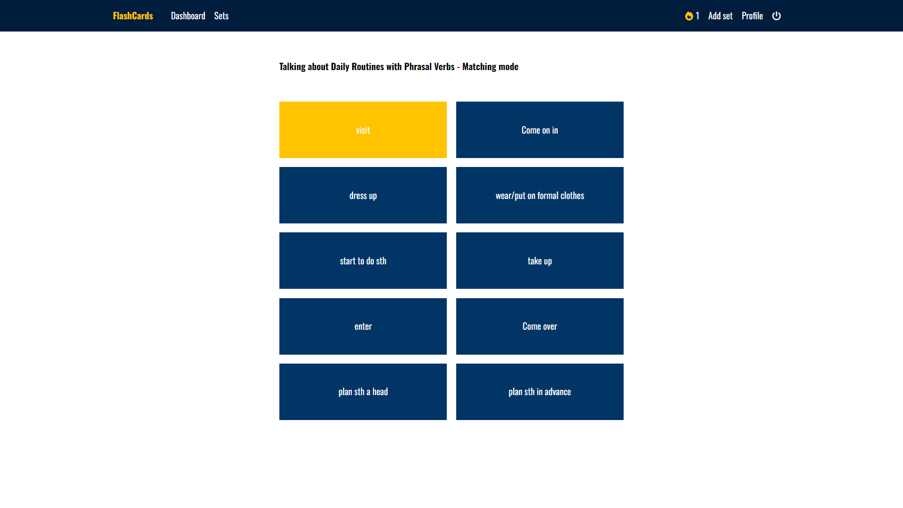
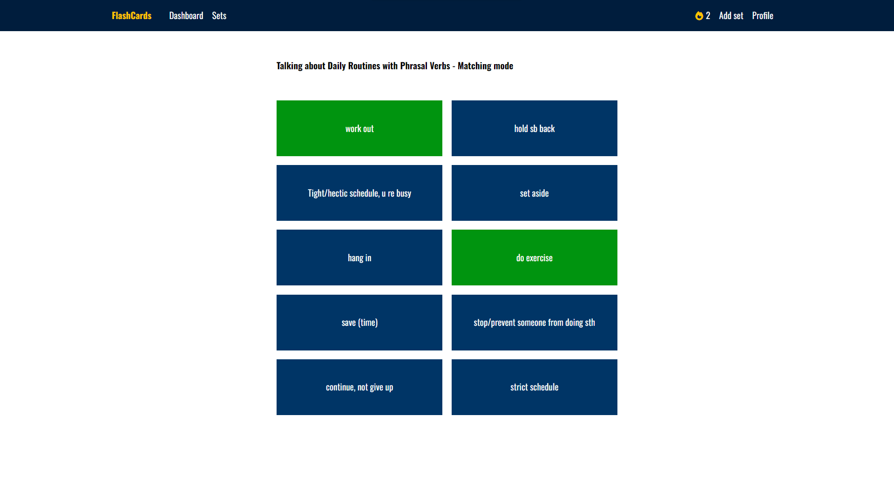

# FlashCards

## Table of content

- [FlashCards](#flashcards)
  - [Table of content](#table-of-content)
  - [General info](#general-info)
  - [Technologies and libraries](#technologies-and-libraries)
  - [Setup](#setup)
  - [Build](#build)
  - [Features](#features)
  - [Screenshots](#screenshots)
    - [Mobile](#mobile)
    - [Desktop](#desktop)

## General info

<b>Keep Your Flashcards</b> is an application that gives you the opportunity to expand your knowledge using virtual flashcards. <br />
The application provides four learning modes: learn, repeat, test, match <br /> <br />
<b>Study mode</b> - allows you to view the list of cards. In this mode you can see both sides of the card or just one side and turn the card over to see the back. <br />
<b>Repeat mode</b> - in this mode you only see the question and you have to answer it. Next, you can compare your answer with the correct answer. <br />
<b>Test Mode</b> - in this mode you are given 10 random questions, selected from a list of all your cards in the set. Each question has 4 answer but only one is correct. <br />
<b>Matching mode</b> - in this mode you have randomly placed questions and answers. Your task is to properly match the question with the answer.

This project was bootstrapped with [Create React App](https://github.com/facebook/create-react-app).

<hr />
Demo account: <br />
login: test@test.pl <br />
pass: Test123@
<hr />

Project status: _in progress_

## Technologies and libraries

- React
- React-Router-Dom
- Tailwind
- TypeScript
- React-hook-form
- React-query
- Axios
- Fontawesome
- React-Testing-Library

## Setup

To run this project, install it locally using npm:

```
npm install
npm run dev
```

## Build

To build this project:

```
npm run build
```

## Features

- Log in
- Sign up
- Remind password
- Create / Update / Delete set of flashcards
- Create / Update / Delete flashcards in a selected set
- List of sets
- Display last active set
- Study mode
- Repetition mode
- Matching mode
- Test mode
- Weekly activity calendar
- Text to Speech in Repetition and Study mode

## Screenshots

### Mobile

<div>
  

  
  

  
  
  

  
  

  
  

  

  

  
  
  

  

  
  
  

  
  
  
  
  
  
  
  

  
</div>

### Desktop

  
  
  

  
  

  
  
  

  
  

  
  

  

  

  
  
  

  

  
  
  

  
  
  
  
  
  
  
  

  
